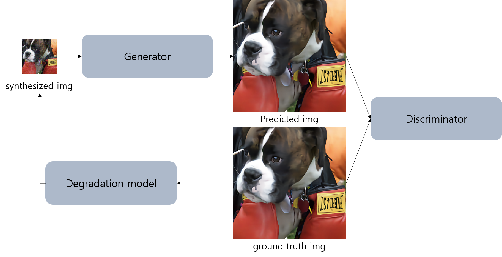
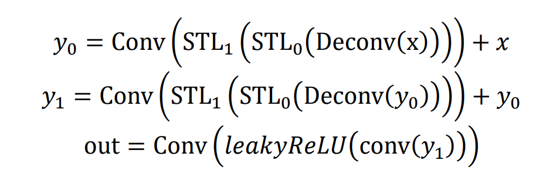

# LePESwinSR
Swin Transformer for Real World Super Resolution Using Locally-enhanced Position Encoding

## Abstract
Real-world images can contain degradation such as camera blur, sensor noise, low resolution and JPEG compression.
To deal with this problem, we propose our model which can restore LR images sufferring from unknown and complex degradations.
1. Degradation model which make synthesized dataset - effect on data augmentation
2. GAN arichitecture - To restore natural texture and sharp edge
3. Swin transformer layer with Locally-enhanced Position Encoding - adjacent pixel information is important in SR task
4. Neck consists of deconvolution layer and RSTB module with local window size 4 - considering adjacent pixels and upsampling features. 

This is thesis for the Master of Science [[thesis](https://drive.google.com/file/d/18gJewIzNnOzD1OfGzI7lEhNSgfHeKVK0/view?ths=true)]

## Proposed algorithm
- overview


- generator


- LePE(Locally-enhanced Position Encoding)


- Neck


- discriminator


## Ablation study (visual results)


## Comparison with other models


[Training code]
- train -PSNR model
```
python main_train.py
```

- train -GAN model
```
python main_train_gan.py
```
Download pre-trained models: [Google Drive](https://drive.google.com/drive/u/1/folders/1gYvlfsDR71p2ScDjUSXDwW-EqS7Bcw4k)

## Contact

If you have any question, please email `ehdrmfdl8888@naver.com`.