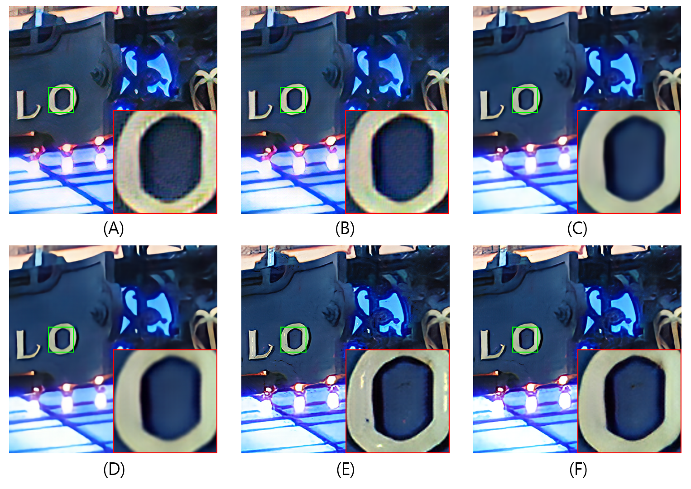
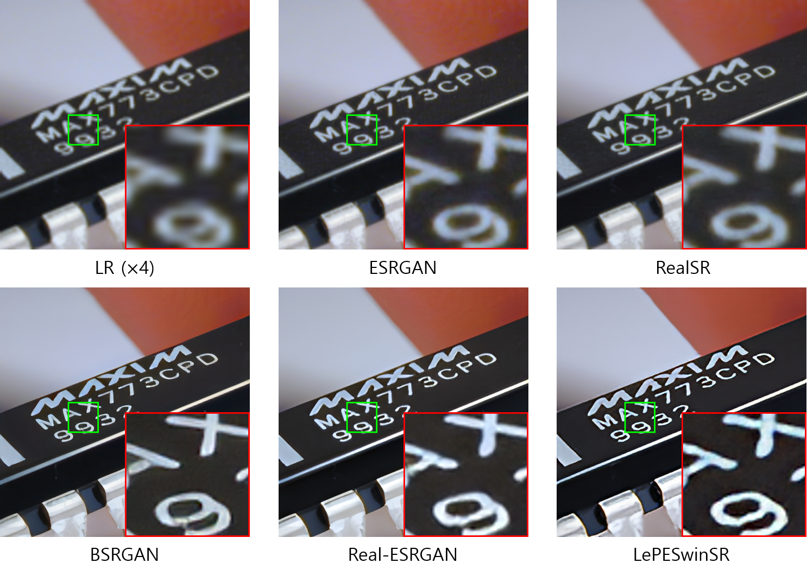

# LePESwinSR
Swin Transformer for Real World Super Resolution Using Locally-enhanced Position Encoding

## Proposed algorithm
- generator

- LePE(Locally-enhanced Position Encoding)

- Neck

- discriminator


## Ablation study





## Comparison with other models





[Training code]
- train -PSNR
```
python main_train.py
```

- train -GAN 
```
python main_train_gan.py
```